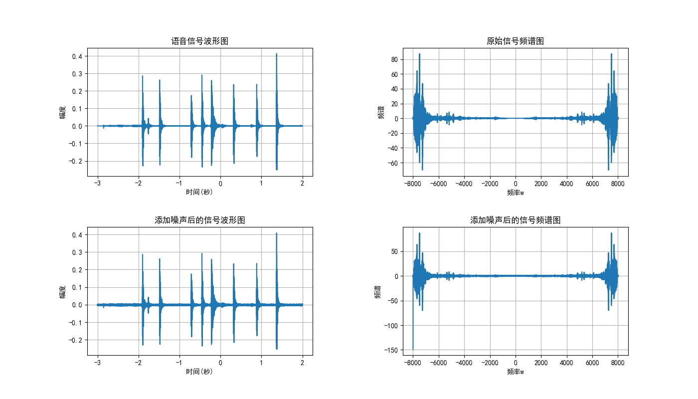
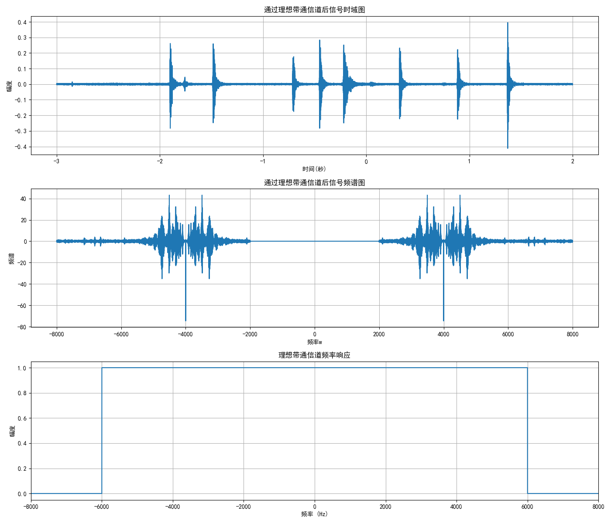
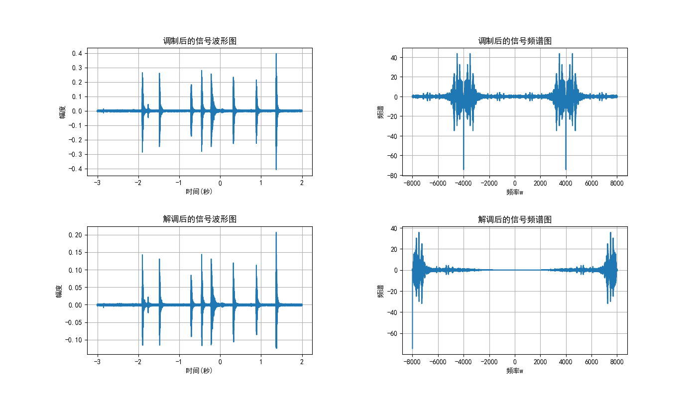
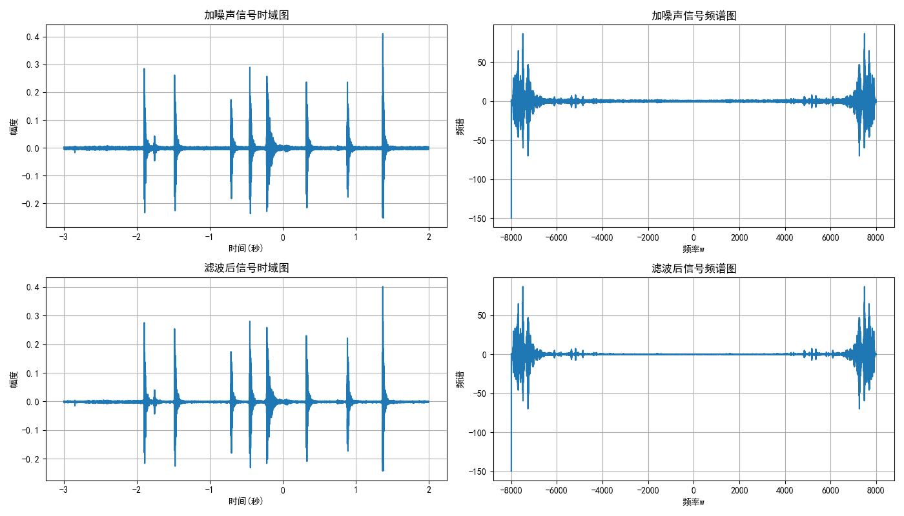

# 综合实验1 语音信号调制与传输

|   学号   |  姓名  | 分工 |
| :------: | :----: | :--: |
| 23336047 | 陈奕航 | 1&2 |
| 23336031 | 陈曾嵘 | 4&6 |
| 23336050 | 陈泽义 | 7&8 |
| 23336040 | 陈俊鑫 | 3&5 |

## 一、问题描述

对于一段语音信号，我们要进行如下操作：

1. 画出语音信号的时域波形和频谱图；
2. 给原始语音信号加噪声，画出加噪声后的语音信号和频谱图；
3. 设计一个频域的理想带通信道；
4. 对加噪声后的语音信号进行幅度调制，画出调制后的语音信号和频谱图；
5. 利用理想带通信道对信号进行传输；
6. 对接收到的信号进行解调，画出解调后的语音信号和频谱图；
7. 设计性能良好的滤波器对信号进行滤波；
8. 对滤波后的语音信号进行回放，并与原始语音进行对比。

## 二、问题分析与解决思路

### 1. 画出语音信号的时域波形和频域图

**这里我们采用 `python`的 `pydub`(需要配置ffmpeg)库对 `m4a`格式的音频信号进行读取分析，此外还需要numpy、matplot**

1. 定义一个 `load_audio`函数读取音频信号，获得音频的时域信号 `samples`和采样率 `sr`
2. 定义一个 `plot_time_domain`函数负责画出时域特征图像
3. 定义一个 `plot_spectrum`函数负责画出频域图
4. 在主函数实现上述函数的调用并获得图像

### 2. 给原始语音信号加噪声并画出图像

1. 我们定义一个较为常见的高斯白噪声函数 `add_white_noise`，参数为原信号和信噪比 `dB`，返回处理后的信号与噪声
2. 为了后续方便对信号进行调制与滤波，信噪比选择15(中等信噪比：噪声明显但不会严重干扰信号识别)
3. 在主函数中调用 `plot_time_domain`和 `plot_spectrum`画出添加噪声后的时域图和频域图

### 3. 设计一个频域的理想带通信道

#### 原理

理想带通信道是一种只允许特定频率范围内的信号通过，而阻止其他频率信号的传输信道。在频域中，理想带通滤波器可以表示为：

$$
H(f) = 
\begin{cases}
1, & f_l \leq |f| \leq f_h \\
0, & \text{其他}
\end{cases}
$$

其中 $f_l$ 和 $f_h$ 分别是带通信道的下限频率和上限频率。

#### 实现方法

我们的实现基于以下步骤：

1. 将时域信号通过FFT转换到频域
2. 在频域构造一个理想带通滤波器响应
3. 将频域信号与滤波器响应相乘
4. 通过IFFT将结果转回时域

#### 代码实现

```python
def ideal_bandpass_channel(signal, sr, low_freq, high_freq):
    # 将信号转换到频域
    signal_fft = np.fft.fft(signal)
    n = len(signal_fft)
  
    # 创建频率轴
    freq = np.fft.fftfreq(n, 1/sr)
  
    # 创建理想带通滤波器的频率响应
    bandpass_filter = np.zeros(n, dtype=complex)
    bandpass_filter[((freq >= low_freq) & (freq <= high_freq)) | 
               ((freq >= -high_freq) & (freq <= -low_freq))] = 1
  
    # 应用滤波器
    filtered_fft = signal_fft * bandpass_filter
  
    # 转回时域
    filtered_signal = np.real(np.fft.ifft(filtered_fft))
  
    return filtered_signal, bandpass_filter
```

该函数接收输入信号、采样率以及带通信道的下限和上限频率，返回经过信道后的信号和信道的频率响应。

### 4. 对加噪声后的语音信号进行幅度调制，画出调制后的语音信号和频谱图

#### 原理

假设加噪声后的语音信号（基带信号）为 $m(t)$，其频谱为 $M(f)$。
选择一个高频余弦信号作为载波：$c(t) = A_c \cos(2\pi f_c t)$，其中 $A_c$ 是载波幅度（为了简化，我们常设 $A_c=1$，$f_c$ 是载波频率。

幅度调制（$DSB-SC$）就是将基带信号 $m(t)$ 与载波信号 $c(t)$ 相乘：
$ s(t) = m(t) \cdot c(t) = m(t) \cos(2\pi f_c t)$

我们知道 $\cos(2\pi f_c t) = \frac{1}{2} (e^{j2\pi f_c t} + e^{-j2\pi f_c t})$。
根据傅里叶变换的频移性质（若 $x(t) \leftrightarrow X(f)$，则 $x(t)e^{j2\pi f_0 t} \leftrightarrow X(f-f_0)$和线性性质：
$S(f) = \mathcal{F}\{m(t) \cos(2\pi f_c t)\} = \frac{1}{2} [M(f - f_c) + M(f + f_c)]$

#### 代码

* `signal`: 已经加载并添加了噪声的语音信号 (NumPy 数组)。
* `sr`: 采样率。
* `t`: 对应的时间轴 NumPy 数组，`t = np.arange(len(signal)) / sr`。
* 选择一个合适的载波频率 `fc`。这个频率应该远大于语音信号的最高频率，同时小于奈奎斯特频率(sr/2)，`sr / 4` 是一个不错的选择，能清晰看到频谱搬移。
* 生成载波信号: `carrier = np.cos(2 * np.pi * fc * t)`。
* 进行调制，将噪声语音信号与载波信号逐点相乘: `modulated_signal = y_noisy * carrier`。
* 调用 `plot_time_domain`和 `plot_spectrum`画出时域图和频域图

### 5. 利用理想带通信道对信号进行传输

#### 传输过程

在现实的通信系统中，信号经过调制后通常需要通过一个带通信道进行传输。这个过程会限制信号的频率范围，可能导致部分信息丢失。我们的传输过程模拟了这一现象。

#### 参数设置

我们设计了以下参数用于信号传输：

- 中心频率：sr/8 Hz（sr为采样率）
- 带宽：8000 Hz
- 通带下限：center_freq - bandwidth/2
- 通带上限：center_freq + bandwidth/2

#### 代码实现

```python
def transmit_signal(modulated_signal, sr, low_freq, high_freq):
    transmitted_signal, channel_response = ideal_bandpass_channel(modulated_signal, sr, low_freq, high_freq)
    return transmitted_signal, channel_response

# 在主程序中的应用
center_freq = sr / 8
bandwidth = 8000 
low_freq = center_freq - bandwidth / 2
high_freq = center_freq + bandwidth / 2

transmitted_signal, channel_response = transmit_signal(modulated_signal, sr, low_freq, high_freq)
```

### 6. 对接收到的信号进行解调，画出解调后的语音信号和频谱图

#### 原理

同步解调 (Coherent Demodulation):

它要求接收端有一个与发送端载波**频率和相位都完全同步**的本地载波。

1. **乘以本地载波**: 将接收到的信号再次乘以一个与原始载波完全相同的本地载波 $\cos(2\pi f_c t)$:

   $$
   \begin{aligned}
    v(t) &= s(t) \cdot \cos(2\pi f_c t) \quad \\
    &= [m(t) \cos(2\pi f_c t)] \cdot \cos(2\pi f_c t) \\
    &= m(t) \cos^2(2\pi f_c t) \\
    &= m(t) \left[ \frac{1}{2} (1 + \cos(4\pi f_c t)) \right] \\
    &= \frac{1}{2} m(t) + \frac{1}{2} m(t) \cos(4\pi f_c t)
    \end{aligned}
   $$
2. **频谱变化**:

   * $\frac{1}{2} m(t)$ 项的频谱是 $\frac{1}{2} M(f)$。这正是我们想要的原始信号（只是幅度减半）。
   * $\frac{1}{2} m(t) \cos(4\pi f_c t)$ 项是一个再次被调制的信号，其频谱是 $\frac{1}{4} [M(f - 2f_c) + M(f + 2f_c)]$。这个分量的频谱被搬移到了以 $+2f_c$ 和 $-2f_c$ 为中心的高频区域。
3. **低通滤波 (Low-Pass Filtering, LPF)**:
   为了得到 $\frac{1}{2} m(t)$，需要滤除掉高频分量 $\frac{1}{2} m(t) \cos(4\pi f_c t)$。这可以通过一个低通滤波器实现。
   低通滤波器的截止频率 (`cutoff frequency`) 应该设置在原始基带信号的最高频率 $B$ 略高一点，但要远低于 $2f_c$。这样，$M(f)$ 项能通过，而 $M(f \pm 2f_c)$ 项被滤除。

   滤波后得到的信号即为 $\frac{1}{2} m(t)$，成功恢复了原始语音信号（除了一个幅度因子）。

#### 代码

* `signal`: 经过带通信道传输后的已调信号 (NumPy 数组)。
* `carrier`: 与调制时使用的**完全相同**的载波信号 `np.cos(2 * np.pi * fc * t)`。
* `sr`, `t` 同上。
* `demodulated_signal_raw = signal_through_channel * carrier`。
* 确定低通滤波器的截止频率 `lpf_cutoff`。它应该大于基带信号的带宽 (`baseband_max_freq + 500`)，但远小于 `2 * fc`。
* 使用 `scipy.signal.butter` 设计一个巴特沃斯低通滤波器，得到滤波器系数 `b, a`。
* 使用 `scipy.signal.lfilter(b, a, demodulated_signal_raw)` 对信号进行滤波，得到 `demodulated_signal_filtered`。
* 调用 `plot_time_domain`和 `plot_spectrum`画出时域图和频域图

### 7. 设计性能良好的滤波器对信号进行滤波

> - 综合比较了多种滤波器（巴特沃斯（单向与双向），Wiener滤波，小波去噪（Wavelet Denoising）等）的性能，最终 Wiener 滤波器的效果最好

- weiner 滤波器的实现原理是：
- 假设原始信号为 \(x(t)\)，噪声为 \(w(t)\)，接收到的信号为 \(y(t) = x(t) + w(t)\)。
  - Wiener 滤波器的目标是估计原始信号 \(x(t)\)。
  - Wiener 滤波器的输出为：
  - $$
    \hat{x}(t) = H(t)y(t)
    $$
  - 其中 \(H(t)\) 是 Wiener 滤波器的传递函数，定义为：
  - $$
    H(t) = \frac{S_x(t)}{S_x(t) + S_w(t)}
    $$
  - 其中 \(S_x(t)\) 是原始信号的功率谱密度，\(S_w(t)\) 是噪声的功率谱密度。
  - 通过对 \(y(t)\) 进行傅里叶变换，得到频域信号 \(Y(f)\)，然后计算功率谱密度 \(S_y(f)\)。
  - 最后，使用 Wiener 滤波器的传递函数 \(H(f)\) 对频域信号进行滤波，得到估计的原始信号 \(\hat{X}(f)\)，再进行逆傅里叶变换得到时域信号 \(\hat{x}(t)\)。
- 部分代码解释：
  - 如何将信号转化为频域信号,利用 `numpy.fft.fft` 函数进行快速傅里叶变换

    ```py
    # 信号转换为频域
    signal_fft = np.fft.fft(signal)
    ```
  - 同样的，如何将频域信号转化为时域信号,利用 `numpy.fft.ifft` 函数进行快速傅里叶逆变换即可

    ```py
    # 转回时域
    filtered_signal = np.real(np.fft.ifft(filtered_fft))
    ```
  - 为了得到原始信号的功率谱，可以从传入的 `signal` 入手：`signal_power_spectrum = np.abs(signal_fft) ** 2`
  - 但是噪声一般是没有功率谱的，由于前面的步骤添加的噪声是高斯白噪声，所以可以直接用 `np.mean(signal_power_spectrum)` 来估计噪声的功率谱：

    ```py
    noise_power_spectrum = np.mean(
        signal_power_spectrum[-int(len(signal) / 10) :]) * np.ones_like(signal_fft)
    ```

    - 这里假设噪声的功率谱是一个常数，等于信号功率谱的均值
    - `signal_power_spectrum[-int(len(signal) / 10) :]` 取最后 1/10 的数据来估计噪声功率谱
  - 如果有噪声的功率，直接使用：`noise_power_spectrum = np.ones_like(signal_fft) * noise_power`
  - 最后，应用滤波器并且转回时域即可

    ```py
    # 应用滤波器
    filtered_fft = signal_fft * wiener_filter

    # 转回时域
    filtered_signal = np.real(np.fft.ifft(filtered_fft))
    ```

## 三、实验代码

### 1&2

```py
import numpy as np
import matplotlib.pyplot as plt
from pydub import AudioSegment
import os
import warnings
warnings.filterwarnings("ignore")  # 去掉常规警告

def load_audio(file_path):
    # 使用pyhub读取m4a文件
    audio = AudioSegment.from_file(file_path)
    # 将音频转化为numpy数组
    samples = np.array(audio.get_array_of_samples())

    # 如果是立体声，转换为单声道
    if audio.channels == 2:
        samples = samples.reshape((-1, 2))
        samples = samples.mean(axis=1)

    # 获取采样率
    sr = audio.frame_rate

    # 将samples标准化到[-1,1]
    samples = samples / (2**15) if samples.dtype == np.int16 else samples / (2**31)

    return samples, sr

# 绘制时域特征
def plot_time_domain(samples, sr, title):
    duration = len(samples) / sr
    t = np.linspace(-duration // 2, duration // 2, len(samples))

    plt.plot(t, samples)
    plt.title(title)
    plt.xlabel("时间(秒)")
    plt.ylabel('幅度')
    plt.grid()

# 绘制频谱图
def plot_spectrum(samples, sr, title):
    Xw = np.fft.fft(samples)
    w = np.linspace(-sr/2, sr/2, len(Xw))

    plt.plot(w, Xw)
    plt.title(title)
    plt.xlabel("频率w")
    plt.ylabel("频谱")
    plt.grid()

def add_white_noise(signal, snr_db):
    """
    添加高斯白噪声
    signal: 输入信号
    snr_db: 信噪比(dB)
    """
    # 计算信号功率
    signal_power = np.mean(signal**2)
  
    # 根据SNR计算噪声功率
    noise_power = signal_power / (10**(snr_db/10))
  
    # 生成高斯白噪声
    noise = np.random.normal(-np.sqrt(noise_power)/2, np.sqrt(noise_power)/2, len(signal))
  
    # 添加噪声到信号
    noisy_signal = signal + noise
  
    return noisy_signal, noise
 
def add_sinusoidal_noise(signal, sr, freq, amplitude):
    """
    添加正弦噪声
    signal: 输入信号
    sr: 采样率
    freq: 噪声频率(Hz)
    amplitude: 噪声幅度
    """
    # 创建时间向量
    t = np.arange(0, len(signal)) / sr
  
    # 生成正弦噪声
    noise = amplitude * np.sin(2 * np.pi * freq * t)
  
    # 添加噪声到信号
    noisy_signal = signal + noise
  
    return noisy_signal, noise

if __name__ == "__main__":
    audio_file = "signal-system/audio/test.m4a"  
    samples, sr = load_audio(audio_file)
    print(f"样本信号采样率：{sr}, 时长：{len(samples)/sr:.2f}")
    plt.rcParams['font.sans-serif'] = ['SimHei']  # 设置字体为黑体
    plt.rcParams['axes.unicode_minus'] = False  # 显示负号
    plt.subplots(2, 2, figsize=(14, 8), dpi=100)
    plt.subplots_adjust(wspace = 0.4, hspace = 0.4)
  
    # 绘制时域特征
    plt.subplot(221)
    plot_time_domain(samples, sr, "语音信号波形图")
  
    # 绘制频域图
    plt.subplot(222)
    plot_spectrum(samples, sr, "原始信号频谱图")

    # 添加高斯白噪声
    noisy_signal, noise = add_white_noise(samples, 15)

    # 添加正弦噪声(可选)
    # noisy_signal, noise = add_sinusoidal_noise(samples, sr, 1000, 0.2)

    plt.subplot(223)
    plot_time_domain(noisy_signal, sr, "添加噪声后的信号波形图")
    plt.subplot(224)
    plot_spectrum(noisy_signal, sr, "添加噪声后的信号频谱图")

    plt.savefig("原始信号与噪声信号.png")
    plt.show()


```

### 3&5

```python
import numpy as np
import matplotlib.pyplot as plt
from task1_2 import load_audio, add_white_noise, plot_time_domain, plot_spectrum
from task4_6 import amplitude_modulation, amplitude_demodulation
import sounddevice as sd
import soundfile as sf

# 设置中文字体和负号显示
plt.rcParams["font.sans-serif"] = ["SimHei"]
plt.rcParams["axes.unicode_minus"] = False

def ideal_bandpass_channel(signal, sr, low_freq, high_freq):
    signal_fft = np.fft.fft(signal)
    n = len(signal_fft)
  
    freq = np.fft.fftfreq(n, 1/sr)
  
    bandpass_filter = np.zeros(n, dtype=complex)
    bandpass_filter[((freq >= low_freq) & (freq <= high_freq)) | 
               ((freq >= -high_freq) & (freq <= -low_freq))] = 1
  
    filtered_fft = signal_fft * bandpass_filter
    filtered_signal = np.real(np.fft.ifft(filtered_fft))
  
    return filtered_signal, bandpass_filter


def transmit_signal(modulated_signal, sr, low_freq, high_freq):
    transmitted_signal, channel_response = ideal_bandpass_channel(modulated_signal, sr, low_freq, high_freq)
    return transmitted_signal, channel_response


def plot_channel_response(channel_response, sr, title, ax=None):
    n = len(channel_response)
    freq = np.fft.fftfreq(n, 1/sr)
  
    idx = np.argsort(freq)
    sorted_freq = freq[idx]
    sorted_response = np.abs(channel_response)[idx]
  
    if ax is None:
        ax = plt.gca()
    ax.plot(sorted_freq, sorted_response)
    ax.set_title(title)
    ax.set_xlabel("频率 (Hz)")
    ax.set_ylabel("幅度")
    ax.grid(True)
    ax.set_xlim(-sr/2, sr/2)


if __name__ == "__main__":
    # 读取原始音频
    samples, sr = load_audio("audio/test.m4a")
  
    # 添加白噪声
    noisy_signal, noise = add_white_noise(samples, 15)
  
    # 幅度调制
    modulated_signal, carrier = amplitude_modulation(noisy_signal, sr)
  
    # 设置带通信道参数
    center_freq = sr / 8
    bandwidth = 8000 
    low_freq = center_freq - bandwidth / 2
    high_freq = center_freq + bandwidth / 2
  
    # 通过理想带通信道传输
    transmitted_signal, channel_response = transmit_signal(modulated_signal, sr, low_freq, high_freq)
  
    # 保存传输后的信号
    sf.write("transmitted_signal.wav", transmitted_signal, sr)
  
    plt.figure(figsize=(14, 12), dpi=100)

    # 时域图
    plt.subplot(3, 1, 1)
    plot_time_domain(transmitted_signal, sr, "通过理想带通信道后信号时域图")
  
    # 频谱图
    plt.subplot(3, 1, 2)
    plot_spectrum(transmitted_signal, sr, "通过理想带通信道后信号频谱图")
  
    # 信道频率响应
    ax3 = plt.subplot(3, 1, 3)
    plot_channel_response(channel_response, sr, "理想带通信道频率响应", ax=ax3)
  
    plt.tight_layout()
    plt.savefig("3_5_all_figures.png")
  
    # 播放通过信道后的信号
    print("正在播放通过理想带通信道后的信号...")
    sd.play(transmitted_signal, sr)
    sd.wait()
```

### 4&6

```py
# --- Helper function for low-pass filter ---
def _butter_lowpass_filter(data, cutoff_freq, sample_rate, order=5):
    nyquist_freq = 0.5 * sample_rate
    normal_cutoff = cutoff_freq / nyquist_freq
    b, a = butter(order, normal_cutoff, btype='low')
    filtered_data = lfilter(b, a, data)
    return filtered_data

# --- Step 5: Amplitude Modulation ---
def amplitude_modulation(signal, sr, carrier):
    t = np.arange(len(signal)) / sr
    fc = sr / 4  # carrier frequency
    carrier = np.cos(2 * np.pi * fc * t) # cos(2πf_ct)
    return signal * carrier

# --- Step 7: Amplitude Demodulation ---
def amplitude_demodulation(signal, sr, carrier):
    demodulated_signal_raw = signal * carrier
    lpf_cutoff = baseband_max_freq + 500
    demodulated_signal_filtered = _butter_lowpass_filter(demodulated_signal_raw, lpf_cutoff, sr, order=6)
    return demodulated_signal_filtered
```

### 7&8

```py
import numpy as np
import matplotlib.pyplot as plt
from task2_3 import load_audio, add_white_noise, plot_time_domain, plot_spectrum
import sounddevice as sd
import soundfile as sf

plt.rcParams["font.sans-serif"] = ["SimHei"]
plt.rcParams["axes.unicode_minus"] = False


def wiener_filter(signal, noise_power=None):
    # 信号转换为频域
    signal_fft = np.fft.fft(signal)
    signal_power_spectrum = np.abs(signal_fft) ** 2

    if noise_power is not None:
        noise_power_spectrum = np.ones_like(signal_fft) * noise_power
    else:
        # 如果没有提供噪声信息，尝试从信号中估计噪声功率
        noise_power_spectrum = np.mean(
            signal_power_spectrum[-int(len(signal) / 10) :]
        ) * np.ones_like(signal_fft)

    # 维纳滤波器传递函数：H(f) = Ps(f) / (Ps(f) + Pn(f))
    wiener_filter = signal_power_spectrum / (
        signal_power_spectrum + noise_power_spectrum
    )

    # 应用滤波器
    filtered_fft = signal_fft * wiener_filter

    # 转回时域
    filtered_signal = np.real(np.fft.ifft(filtered_fft))

    return filtered_signal


if __name__ == "__main__":
    # 读取原始音频
    samples, sr = load_audio("audio/test.m4a")
    # 添加白噪声
    noisy_signal, noise = add_white_noise(samples, 15)
    # 滤波
    filtered_signal = wiener_filter(noisy_signal, noise_power=7.5)
    # 保存加噪声后的信号
    sf.write("noisy_signal.wav", noisy_signal, sr)
    # 保存滤波后的信号
    sf.write("filtered_signal.wav", filtered_signal, sr)

    # 绘图
    plt.figure(figsize=(14, 8), dpi=100)
    plt.subplot(221)
    plot_time_domain(noisy_signal, sr, "加噪声信号时域图")
    plt.subplot(222)
    plot_spectrum(noisy_signal, sr, "加噪声信号频谱图")
    plt.subplot(223)
    plot_time_domain(filtered_signal, sr, "滤波后信号时域图")
    plt.subplot(224)
    plot_spectrum(filtered_signal, sr, "滤波后信号频谱图")
    plt.tight_layout()
    plt.savefig("8&9.png")

    # 播放原始、加噪声、滤波后信号
    print("正在播放原始信号...")
    sd.play(samples, sr)
    sd.wait()
    print("正在播放加噪声信号...")
    sd.play(noisy_signal, sr)
    sd.wait()
    print("正在播放滤波后信号...")
    sd.play(filtered_signal, sr)
    sd.wait()

```

## 四、实验结果

### 1&2



### 3&5



- 通过理想带通信道之后的音频：[🎵 transmitted_signal.wav](./audio/transmitted_signal.wav)

### 4&6



### 7&8



- 加噪声音频：[🎵 noisy_signal.wav](./audio/noisy_signal.wav)
- 滤波后音频：[🎵 filtered_signal.wav](./audio/filtered_signal.wav)

## 五、结论

- 实现了语音信号的幅度调制、带通信道传输、解调和滤波，验证了通信系统的基本流程。
- 理想带通信道有效限制了信号频带，维纳滤波器能较好地抑制噪声并恢复信号。

## 六、收获与感想

陈曾嵘(4&6):

- 理解了调制、解调、滤波等通信系统核心环节。
- 掌握了信号时域、频域分析及Python信号处理方法。
- 实践中提升了参数调优和问题解决能力。

陈奕航(1&2)：

* 通过完成语音信号时域/频域分析与加噪处理，我对信号处理有了更深入的理解。在实现过程中，我学会了如何使用Python的pydub库读取和处理音频文件，这种编程方式比传统的MATLAB更灵活便捷。特别是在处理不同格式的音频文件时，pydub与ffmpeg的结合提供了强大的兼容性。
* 在时域与频域分析过程中，我深刻体会到了两种表示方式各自的优势：时域波形直观展示了信号随时间的变化特性，而频谱图则揭示了信号的频率组成。这种双重视角使我能够更全面地理解语音信号的特性。
* 在添加噪声环节，我实现了高斯白噪声函数，并通过调整信噪比参数来控制噪声强度。选择15dB的信噪比是经过反复测试的结果，这一数值既能让噪声明显可见，又不会完全破坏原始信号的特征，为后续的信号调制和滤波实验奠定了良好基础。

陈泽义(7&8)：

- 了解了多种滤波器的原理和实现方法，成功实现了简单维纳滤波器的设计与应用
- 对比了不同滤波器的性能，发现维纳滤波器在噪声抑制方面表现较好
- 在实现过程中，遇到了一些噪声估计的问题，特别是在没有噪声信息传入时，如何估计噪声功率是一个挑战
- 实现的维纳滤波器虽然简单有效，但在实际应用中可能需要更复杂的噪声估计方法

## 七、创新点

- 添加噪声采用了常见的高斯白噪声
- 尝试了维纳滤波器替代传统滤波，提升了噪声抑制效果。
- 设计了自适应噪声估计机制，增强了系统实用性。
