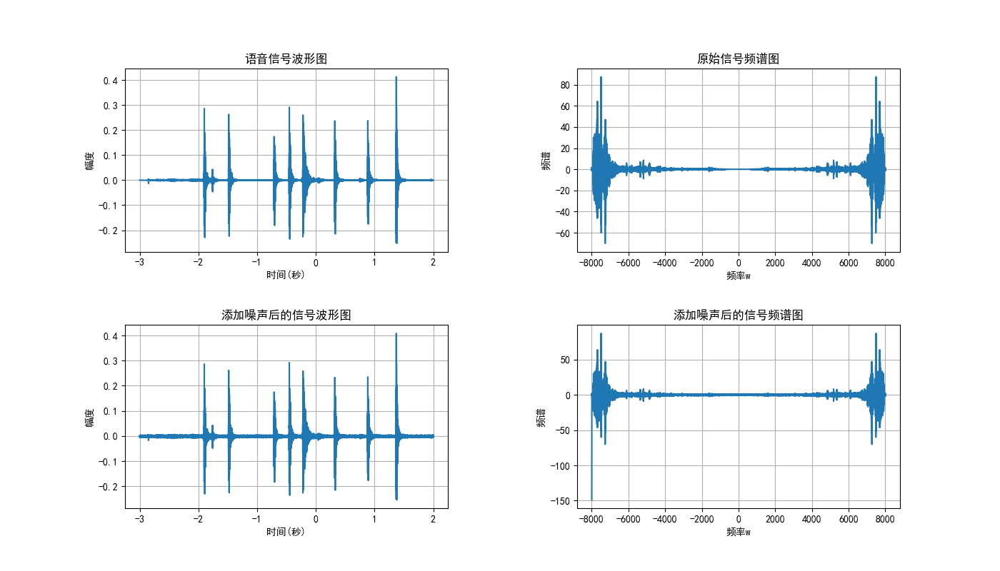
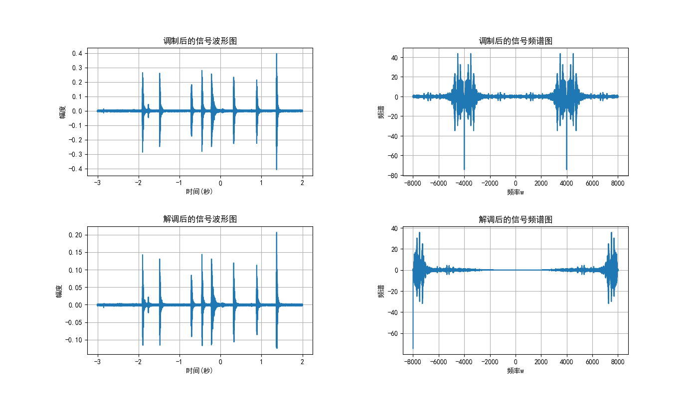

# 综合实验1

| 学号     | 姓名   | 分工 |
| -------- | ------ | ---- |
| 23336047 | 陈奕航 |      |
| 23336031 | 陈曾嵘 |      |
|          |        |      |
|          |        |      |

## 一、问题描述

对于一段语音信号，我们要进行如下操作：

1. 画出语音信号的时域波形和频谱图；、
2. 给原始语音信号加噪声，画出加噪声后的语音信号和频谱图；
3. 设计一个频域的理想带通信道；
4. 对加噪声后的语音信号进行幅度调制，画出调制后的语音信号和频谱图；
5. 利用理想带通信道对信号进行传输；
6. 对接收到的信号进行解调，画出解调后的语音信号和频谱图；
7. 设计性能良好的滤波器对信号进行滤波；
8. 对滤波后的语音信号进行回放，并与原始语音进行对比。

## 二、问题分析与解决思路

### 画出语音信号的时域波形和频域图

**这里我们采用 `python`的 `pydub`(需要配置ffmpeg)库对 `m4a`格式的音频信号进行读取分析，此外还需要numpy、matplot**

1. 定义一个 `load_audio`函数读取音频信号，获得音频的时域信号 `samples`和采样率 `sr`
2. 定义一个 `plot_time_domain`函数负责画出时域特征图像
3. 定义一个 `plot_spectrum`函数负责画出频域图
4. 在主函数实现上述函数的调用并获得图像

### 给原始语音信号加噪声并画出图像

1. 我们定义一个较为常见的高斯白噪声函数 `add_white_noise`，参数为原信号和信噪比 `dB`，返回处理后的信号与噪声
2. 为了后续方便对信号进行调制与滤波，信噪比选择15(中等信噪比：噪声明显但不会严重干扰信号识别)
3. 在主函数中调用 `plot_time_domain`和 `plot_spectrum`画出添加噪声后的时域图和频域图

### 5.对加噪声后的语音信号进行幅度调制，画出调制后的语音信号和频谱图

#### 原理

假设加噪声后的语音信号（基带信号）为 \(m(t)\)，其频谱为 \(M(f)\)。
选择一个高频余弦信号作为载波：\(c(t) = A_c \cos(2\pi f_c t)\)，其中 \(A_c\) 是载波幅度（为了简化，我们常设 \(A_c=1\)），\(f_c\) 是载波频率。

幅度调制（DSB-SC）就是将基带信号 \(m(t)\) 与载波信号 \(c(t)\) 相乘：
\[ s(t) = m(t) \cdot c(t) = m(t) \cos(2\pi f_c t) \]

我们知道 \(\cos(2\pi f_c t) = \frac{1}{2} (e^{j2\pi f_c t} + e^{-j2\pi f_c t})\)。
根据傅里叶变换的频移性质（若 \(x(t) \leftrightarrow X(f)\)，则 \(x(t)e^{j2\pi f_0 t} \leftrightarrow X(f-f_0)\)）和线性性质：
\[ S(f) = \mathcal{F}\{m(t) \cos(2\pi f_c t)\} = \frac{1}{2} [M(f - f_c) + M(f + f_c)] \]

#### 代码

*   `signal`: 已经加载并添加了噪声的语音信号 (NumPy 数组)。
*   `sr`: 采样率。
*   `t`: 对应的时间轴 NumPy 数组，`t = np.arange(len(signal)) / sr`。
*   选择一个合适的载波频率 `fc`。这个频率应该远大于语音信号的最高频率，同时小于奈奎斯特频率(sr/2)，`sr / 4` 是一个不错的选择，能清晰看到频谱搬移。
*   生成载波信号: `carrier = np.cos(2 * np.pi * fc * t)`。
*   进行调制，将噪声语音信号与载波信号逐点相乘: `modulated_signal = y_noisy * carrier`。
*   调用 `plot_time_domain`和 `plot_spectrum`画出时域图和频域图

### 7.对接收到的信号进行解调，画出解调后的语音信号和频谱图

#### 原理

同步解调 (Coherent Demodulation):

它要求接收端有一个与发送端载波**频率和相位都完全同步**的本地载波。

1.  **乘以本地载波**: 将接收到的信号再次乘以一个与原始载波完全相同的本地载波 \(\cos(2\pi f_c t)\):
    \[
    \begin{aligned}
    v(t) &= s(t) \cdot \cos(2\pi f_c t) \quad \\
            &= [m(t) \cos(2\pi f_c t)] \cdot \cos(2\pi f_c t) \\
            &= m(t) \cos^2(2\pi f_c t) \\
            &= m(t) \left[ \frac{1}{2} (1 + \cos(4\pi f_c t)) \right] \\
            &= \frac{1}{2} m(t) + \frac{1}{2} m(t) \cos(4\pi f_c t)
    \end{aligned}
    \]

2.  **频谱变化**:
    *   \(\frac{1}{2} m(t)\) 项的频谱是 \(\frac{1}{2} M(f)\)。这正是我们想要的原始信号（只是幅度减半）。
    *   \(\frac{1}{2} m(t) \cos(4\pi f_c t)\) 项是一个再次被调制的信号，其频谱是 \(\frac{1}{4} [M(f - 2f_c) + M(f + 2f_c)]\)。这个分量的频谱被搬移到了以 \(+2f_c\) 和 \(-2f_c\) 为中心的高频区域。

3.  **低通滤波 (Low-Pass Filtering, LPF)**:
    为了得到 \(\frac{1}{2} m(t)\)，需要滤除掉高频分量 \(\frac{1}{2} m(t) \cos(4\pi f_c t)\)。这可以通过一个低通滤波器实现。
    低通滤波器的截止频率 (cutoff frequency) 应该设置在原始基带信号的最高频率 \(B\) 略高一点，但要远低于 \(2f_c\)。这样，\(M(f)\) 项能通过，而 \(M(f \pm 2f_c)\) 项被滤除。

    滤波后得到的信号即为 \(\frac{1}{2} m(t)\)，成功恢复了原始语音信号（除了一个幅度因子）。

#### 代码
*   `signal`: 经过带通信道传输后的已调信号 (NumPy 数组)。
*   `carrier`: 与调制时使用的**完全相同**的载波信号 `np.cos(2 * np.pi * fc * t)`。
*   `sr`, `t` 同上。

*   `demodulated_signal_raw = signal_through_channel * carrier`。

*   确定低通滤波器的截止频率 `lpf_cutoff`。它应该大于基带信号的带宽 (`baseband_max_freq + 500`)，但远小于 `2 * fc`。
*   使用 `scipy.signal.butter` 设计一个巴特沃斯低通滤波器，得到滤波器系数 `b, a`。
*   使用 `scipy.signal.lfilter(b, a, demodulated_signal_raw)` 对信号进行滤波，得到 `demodulated_signal_filtered`。
*   调用 `plot_time_domain`和 `plot_spectrum`画出时域图和频域图

## 三、实验代码

### 1&2

```
import numpy as np
import matplotlib.pyplot as plt
from pydub import AudioSegment
import os
import warnings
warnings.filterwarnings("ignore")  # 去掉常规警告

def load_audio(file_path):
    # 使用pyhub读取m4a文件
    audio = AudioSegment.from_file(file_path)
    # 将音频转化为numpy数组
    samples = np.array(audio.get_array_of_samples())

    # 如果是立体声，转换为单声道
    if audio.channels == 2:
        samples = samples.reshape((-1, 2))
        samples = samples.mean(axis=1)

    # 获取采样率
    sr = audio.frame_rate

    # 将samples标准化到[-1,1]
    samples = samples / (2**15) if samples.dtype == np.int16 else samples / (2**31)

    return samples, sr

# 绘制时域特征
def plot_time_domain(samples, sr, title):
    duration = len(samples) / sr
    t = np.linspace(-duration // 2, duration // 2, len(samples))

    plt.plot(t, samples)
    plt.title(title)
    plt.xlabel("时间(秒)")
    plt.ylabel('幅度')
    plt.grid()

# 绘制频谱图
def plot_spectrum(samples, sr, title):
    Xw = np.fft.fft(samples)
    w = np.linspace(-sr/2, sr/2, len(Xw))

    plt.plot(w, Xw)
    plt.title(title)
    plt.xlabel("频率w")
    plt.ylabel("频谱")
    plt.grid()

def add_white_noise(signal, snr_db):
    """
    添加高斯白噪声
    signal: 输入信号
    snr_db: 信噪比(dB)
    """
    # 计算信号功率
    signal_power = np.mean(signal**2)
  
    # 根据SNR计算噪声功率
    noise_power = signal_power / (10**(snr_db/10))
  
    # 生成高斯白噪声
    noise = np.random.normal(-np.sqrt(noise_power)/2, np.sqrt(noise_power)/2, len(signal))
  
    # 添加噪声到信号
    noisy_signal = signal + noise
  
    return noisy_signal, noise
 
def add_sinusoidal_noise(signal, sr, freq, amplitude):
    """
    添加正弦噪声
    signal: 输入信号
    sr: 采样率
    freq: 噪声频率(Hz)
    amplitude: 噪声幅度
    """
    # 创建时间向量
    t = np.arange(0, len(signal)) / sr
  
    # 生成正弦噪声
    noise = amplitude * np.sin(2 * np.pi * freq * t)
  
    # 添加噪声到信号
    noisy_signal = signal + noise
  
    return noisy_signal, noise

if __name__ == "__main__":
    audio_file = "signal-system/audio/test.m4a"  
    samples, sr = load_audio(audio_file)
    print(f"样本信号采样率：{sr}, 时长：{len(samples)/sr:.2f}")
    plt.rcParams['font.sans-serif'] = ['SimHei']  # 设置字体为黑体
    plt.rcParams['axes.unicode_minus'] = False  # 显示负号
    plt.subplots(2, 2, figsize=(14, 8), dpi=100)
    plt.subplots_adjust(wspace = 0.4, hspace = 0.4)
  
    # 绘制时域特征
    plt.subplot(221)
    plot_time_domain(samples, sr, "语音信号波形图")
  
    # 绘制频域图
    plt.subplot(222)
    plot_spectrum(samples, sr, "原始信号频谱图")

    # 添加高斯白噪声
    noisy_signal, noise = add_white_noise(samples, 15)

    # 添加正弦噪声(可选)
    # noisy_signal, noise = add_sinusoidal_noise(samples, sr, 1000, 0.2)

    plt.subplot(223)
    plot_time_domain(noisy_signal, sr, "添加噪声后的信号波形图")
    plt.subplot(224)
    plot_spectrum(noisy_signal, sr, "添加噪声后的信号频谱图")

    plt.savefig("原始信号与噪声信号.png")
    plt.show()


```


### 5&7
```
# --- Helper function for low-pass filter ---
def _butter_lowpass_filter(data, cutoff_freq, sample_rate, order=5):
    nyquist_freq = 0.5 * sample_rate
    normal_cutoff = cutoff_freq / nyquist_freq
    b, a = butter(order, normal_cutoff, btype='low')
    filtered_data = lfilter(b, a, data)
    return filtered_data

# --- Step 5: Amplitude Modulation ---
def amplitude_modulation(signal, sr, carrier):
    t = np.arange(len(signal)) / sr
    fc = sr / 4  # carrier frequency
    carrier = np.cos(2 * np.pi * fc * t) # cos(2πf_ct)
    return signal * carrier

# --- Step 7: Amplitude Demodulation ---
def amplitude_demodulation(signal, sr, carrier):
    demodulated_signal_raw = signal * carrier
    lpf_cutoff = baseband_max_freq + 500
    demodulated_signal_filtered = _butter_lowpass_filter(demodulated_signal_raw, lpf_cutoff, sr, order=6)
    return demodulated_signal_filtered
```

## 四、实验结果



### 5&7


## 五、结论

## 六、收获与感想

## 七、创新点
